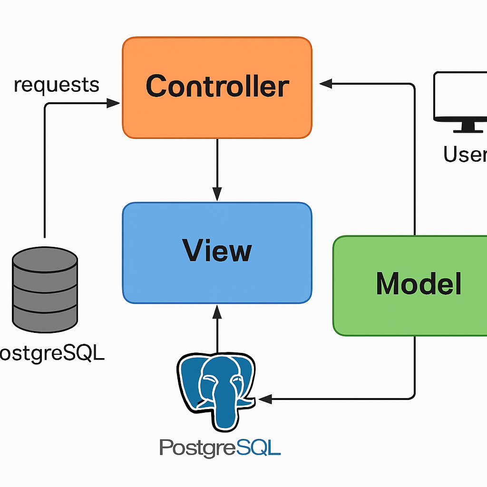
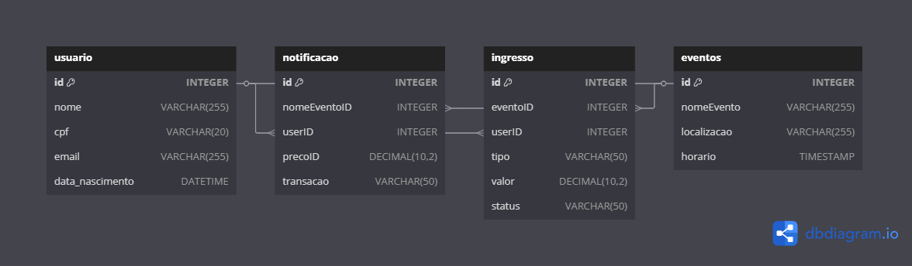

# Web Application Document (WAD) - Sistema Acadêmico

**Versão**: 1.1    
**Autor**: Diego Figueiredo Silva
**Curso**: Ciência da Computação  

## 1. Introdução
    A era digital transformou a forma como gerenciamos informações acadêmicas e organizamos 
    processos educacionais. Nesse contexto, o Sistema Acadêmico surge como um projeto 
    desenvolvido no âmbito acadêmico, para facilitar a gestão de alunos, professores, 
    cursos e tarefas, unindo tecnologia, inovação e usabilidade. 
    Este Web Application Document (WAD) apresenta a essência de uma aplicação web que não apenas 
    atende às necessidades de gestão acadêmica, mas também reflete o compromisso 
    com o aprendizado prático e a aplicação de conceitos fundamentais de desenvolvimento de software.

### 1.1 Objetivo
A criação de um Sistema Acadêmico, uma aplicação web para gerenciar alunos, professores, cursos e tarefas, desenvolvida como projeto da ponderada - INTELI.

### 1.2 Escopo
- Cadastro e gestão de usuários.
- Gerenciamento de alunos e suas associações com cursos.
- Cadastro e gestão de professores.
- Gerenciamento de tarefas.
- Interface simples e responsiva.

## 2. Arquitetura

### 2.1 Visão Geral
Arquitetura com modelo MVC. O frontend exibe a interface, e o backend gerencia dados e lógica de negócio.

### 2.2 Tecnologias
- **Frontend**: EJS, CSS, JavaScript.
- **Backend**: Node.js
- **Banco de Dados**: PostgreSQL.
- **Hospedagem**: Supabase.
- **Ferramentas**: GitHub.

### 2.3 Diagrama da Arquitetura MVC

A arquitetura MVC (Model-View-Controller) é um padrão de design que separa uma aplicação em três componentes principais:




### 2.4 Diagrama do Banco de Dados

O diagrama abaixo representa a estrutura relacional do banco de dados:



## 3. Funcionalidades

### 3.1 Módulos
1. **Usuários**: Cadastro e gestão de usuários do sistema.
2. **Alunos**: Cadastro, edição e exclusão de alunos; associação com cursos.
3. **Professores**: Cadastro, edição e exclusão de professores.
4. **Cursos**: Cadastro e gestão de cursos oferecidos.
5. **Tarefas**: Criação, edição e acompanhamento de tarefas.

## 4. Modelo de Dados

### 4.1 Entidades
- **Usuários**: id, nome, email.
- **Curso**: id, nome.
- **Professor**: id, nome, email.
- **Aluno**: id, nome, email, curso_id.
- **Tarefas**: id, nome, descricao, status, created_at, updated_at.


### 4.2 Modelo Físico (Código SQL)

Abaixo está o código SQL para criação das tabelas do banco de dados:

```sql
CREATE TABLE IF NOT EXISTS usuario (
  id SERIAL PRIMARY KEY,
  nome VARCHAR(255) NOT NULL,
  cpf VARCHAR(20) UNIQUE NOT NULL,
  email VARCHAR(255) UNIQUE NOT NULL,
  data_nascimento DATE
);

-- Tabela de eventos
CREATE TABLE IF NOT EXISTS eventos (
  id SERIAL PRIMARY KEY,
  nomeEvento VARCHAR(255) NOT NULL,
  localizacao VARCHAR(255),
  horario TIMESTAMP NOT NULL
);

-- Tabela de ingressos
CREATE TABLE IF NOT EXISTS ingresso (
  id SERIAL PRIMARY KEY,
  eventoID INTEGER NOT NULL,
  userID INTEGER NOT NULL,
  tipo VARCHAR(50),
  valor DECIMAL(10,2) NOT NULL,
  status VARCHAR(50) DEFAULT 'ativo',
  FOREIGN KEY (eventoID) REFERENCES eventos(id) ON DELETE CASCADE,
  FOREIGN KEY (userID) REFERENCES usuario(id) ON DELETE CASCADE
);

-- Tabela de notificações
CREATE TABLE IF NOT EXISTS notificacao (
  id SERIAL PRIMARY KEY,
  nomeEventoID INTEGER NOT NULL,
  userID INTEGER NOT NULL,
  precoID DECIMAL(10,2),
  transacao VARCHAR(50),
  data_notificacao TIMESTAMP DEFAULT CURRENT_TIMESTAMP,
  FOREIGN KEY (nomeEventoID) REFERENCES eventos(id) ON DELETE CASCADE,
  FOREIGN KEY (userID) REFERENCES usuario(id) ON DELETE CASCADE
);

```

## 5. Implementação MVC

### 5.1 Model
Os models é responsável pela interação com o banco de dados:

```javascript
// exemplo
const pool = require('../config/database');

// Consulta para listar todos os alunos
const result = await pool.query('SELECT * FROM aluno ORDER BY id ASC');
```

### 5.2 Controller
Os controllers processam as requisições e coordenam a lógica de negócio:

```javascript
// exemplo
exports.listarTarefas = async (req, res) => {
  const query = 'SELECT * FROM tarefas';

  try {
    const result = await pool.query(query);
    res.status(200).json(result.rows);
  } catch (err) {
    res.status(500).json({ error: err.message });
  }
};
```

### 5.3 View
O views é responsável pela apresentação dos dados ao usuário:

```javascript
// exemplo 
app.get('/alunos', async (req, res) => {
  const alunos = await Aluno.findAllComCurso();
  res.render('alunos/index', { alunos });
});
```

## 6. Conclusão

A implementação da arquitetura MVC neste projeto proporciona uma separação clara de responsabilidades, facilitando a manutenção e evolução do sistema. O modelo físico do banco de dados foi projetado para suportar todas as funcionalidades necessárias, com relacionamentos adequados entre as entidades.

A combinação de Node.js com Express no backend e PostgreSQL como banco de dados oferece uma solução robusta e escalável para o Sistema Acadêmico, permitindo futuras expansões e melhorias.
